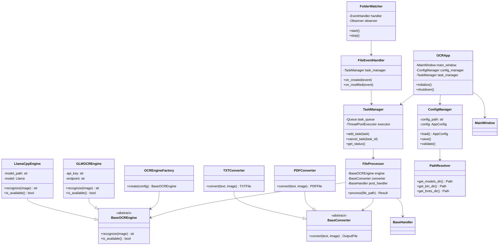
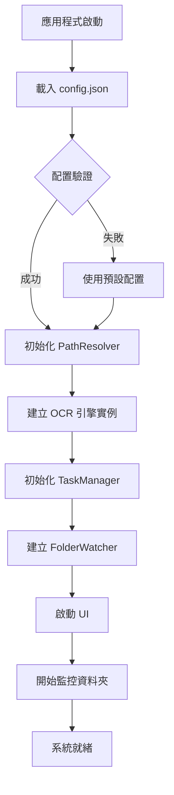
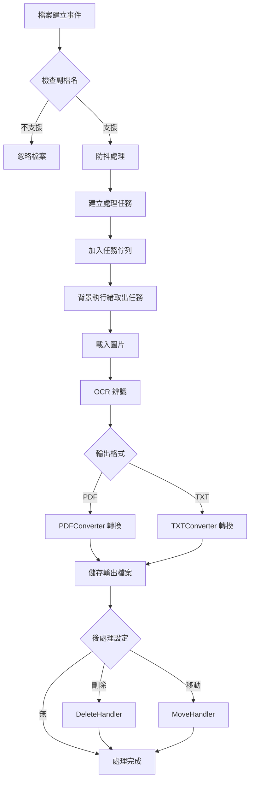
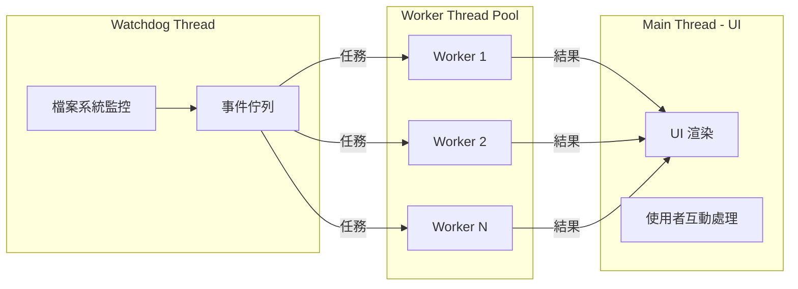

# 跨平台智慧 OCR 監控轉檔系統 - 架構設計文件

## 1. 專案目錄結構

```
Auto-OCR/
├── src/
│   ├── __init__.py
│   ├── main.py                    # 應用程式進入點
│   ├── app.py                     # 應用程式主類別
│   │
│   ├── core/                      # 核心業務邏輯層
│   │   ├── __init__.py
│   │   ├── ocr_engine.py          # OCR 引擎抽象基底類別
│   │   ├── ocr_factory.py         # OCR 引擎工廠
│   │   ├── file_processor.py      # 檔案處理器
│   │   └── task_manager.py        # 任務佇列管理
│   │
│   ├── engines/                   # OCR 引擎實作層
│   │   ├── __init__.py
│   │   ├── base_engine.py         # 抽象基底引擎介面
│   │   ├── glm_ocr_engine.py      # GLM-OCR Cloud API 實作
│   │   └── llama_cpp_engine.py    # llama.cpp GGUF 本地模型實作
│   │
│   ├── monitors/                  # 檔案監控層
│   │   ├── __init__.py
│   │   ├── folder_watcher.py      # watchdog 資料夾監控
│   │   └── event_handler.py       # 檔案事件處理器
│   │
│   ├── converters/                # 輸出轉換層
│   │   ├── __init__.py
│   │   ├── base_converter.py      # 轉換器抽象介面
│   │   ├── pdf_converter.py       # Searchable PDF 轉換器
│   │   └── txt_converter.py       # 純文字轉換器
│   │
│   ├── postprocess/               # 後處理層
│   │   ├── __init__.py
│   │   ├── base_handler.py        # 後處理器抽象介面
│   │   ├── delete_handler.py      # 刪除原始檔案處理器
│   │   └── move_handler.py        # 移動原始檔案處理器
│   │
│   ├── config/                    # 配置管理層
│   │   ├── __init__.py
│   │   ├── config_manager.py      # 配置管理器
│   │   ├── config_schema.py       # 配置結構定義
│   │   └── path_resolver.py       # 跨平台路徑解析器
│   │
│   ├── ui/                        # 使用者介面層
│   │   ├── __init__.py
│   │   ├── main_window.py         # 主視窗
│   │   ├── settings_panel.py      # 設定面板
│   │   ├── status_panel.py        # 狀態監控面板
│   │   ├── log_viewer.py          # 日誌檢視器
│   │   └── components/            # UI 元件
│   │       ├── __init__.py
│   │       ├── file_list.py       # 檔案清單元件
│   │       └── progress_bar.py    # 進度條元件
│   │
│   └── utils/                     # 工具模組
│       ├── __init__.py
│       ├── logger.py              # 日誌工具
│       ├── file_utils.py          # 檔案操作工具
│       ├── image_utils.py         # 圖片處理工具
│       └── platform_utils.py      # 平台偵測工具
│
├── tests/                         # 測試目錄
├── docs/                          # 文件目錄
├── resources/                     # 靜態資源
├── requirements.txt
├── pyproject.toml
├── config.json
└── README.md
```

## 2. 模組劃分設計

### 2.1 核心層 (core/)

- `ocr_engine.py`: 定義 OCR 引擎的抽象介面
- `ocr_factory.py`: 實作工廠模式，根據配置動態建立 OCR 引擎實例
- `file_processor.py`: 協調圖片讀取、OCR 辨識、結果轉換的完整處理流程
- `task_manager.py`: 管理背景任務佇列，確保執行緒安全與任務優先級

### 2.2 引擎層 (engines/)

- `base_engine.py`: 定義 BaseOCREngine 抽象類別
- `glm_ocr_engine.py`: 實作 GLM-OCR Cloud API 串接
- `llama_cpp_engine.py`: 實作本地 GGUF 模型載入與推論

### 2.3 監控層 (monitors/)

- `folder_watcher.py`: 封裝 watchdog 函式庫
- `event_handler.py`: 處理檔案事件並觸發處理流程

### 2.4 轉換層 (converters/)

- `base_converter.py`: 定義輸出轉換器抽象介面
- `pdf_converter.py`: 生成可搜尋 PDF
- `txt_converter.py`: 生成純文字檔案

### 2.5 後處理層 (postprocess/)

- `base_handler.py`: 定義後處理器抽象介面
- `delete_handler.py`: 刪除原始圖片
- `move_handler.py`: 移動原始圖片至指定資料夾

### 2.6 配置層 (config/)

- `config_manager.py`: 配置的載入、儲存與驗證
- `config_schema.py`: 使用 dataclass 定義配置資料結構
- `path_resolver.py`: 根據作業系統解析對應系統路徑

### 2.7 介面層 (ui/)

- `main_window.py`: 應用程式主視窗
- `settings_panel.py`: OCR 引擎選擇、路徑設定、輸出格式配置
- `status_panel.py`: 顯示監控狀態、處理進度
- `log_viewer.py`: 即時顯示應用程式日誌

### 2.8 工具層 (utils/)

- `logger.py`: 配置日誌系統
- `file_utils.py`: 檔案操作輔助函式
- `image_utils.py`: 圖片格式轉換、預處理
- `platform_utils.py`: 作業系統偵測與跨平台相容性

## 3. 類別設計圖

### 核心類別關係



## 4. 配置檔結構 (config.json)

```json
{
  "version": "1.0.0",
  "ocr_engine": {
    "type": "glm_cloud",
    "glm_cloud": {
      "api_key": "",
      "endpoint": "https://api.glm-ocr.example.com/v1/recognize",
      "timeout_seconds": 30,
      "max_retries": 3
    },
    "llama_cpp": {
      "model_path": "",
      "n_ctx": 4096,
      "n_gpu_layers": 0,
      "temperature": 0.1
    }
  },
  "monitor": {
    "input_folder": "",
    "output_folder": "",
    "supported_formats": ["jpeg", "jpg", "bmp", "tiff", "tif"],
    "recursive": false,
    "debounce_seconds": 2
  },
  "output": {
    "formats": ["pdf", "txt"],
    "naming_rule": "original_name",
    "pdf_settings": {
      "font_path": "",
      "font_size": 12,
      "embed_text_layer": true
    }
  },
  "postprocess": {
    "action": "none",
    "move_destination": "",
    "confirm_before_delete": true
  },
  "ui": {
    "theme": "system",
    "language": "zh_TW",
    "minimize_to_tray": true,
    "show_notifications": true
  },
  "logging": {
    "level": "INFO",
    "log_to_file": true,
    "log_file_path": "",
    "max_log_size_mb": 10,
    "backup_count": 5
  }
}
```

### 配置欄位說明

| 區塊 | 欄位 | 說明 |
|------|------|------|
| `ocr_engine` | `type` | 引擎類型：`glm_cloud` 或 `llama_cpp` |
| `ocr_engine.glm_cloud` | `api_key` | GLM-OCR API 金鑰 |
| `ocr_engine.glm_cloud` | `timeout_seconds` | API 請求逾時時間 |
| `ocr_engine.llama_cpp` | `model_path` | GGUF 模型檔案路徑 |
| `ocr_engine.llama_cpp` | `n_gpu_layers` | GPU 加速層數 |
| `monitor` | `input_folder` | 監控的輸入資料夾 |
| `monitor` | `debounce_seconds` | 防抖秒數，避免重複處理 |
| `output` | `formats` | 輸出格式清單 |
| `postprocess` | `action` | 後處理動作：`none`、`delete`、`move` |
| `logging` | `level` | 日誌等級：`DEBUG`、`INFO`、`WARNING`、`ERROR` |

## 5. 執行流程

### 5.1 系統啟動流程



### 5.2 檔案處理流程



### 5.3 執行緒模型



### 執行緒職責說明

| 執行緒 | 職責 |
|--------|------|
| Main Thread (UI) | 渲染 UI、處理使用者互動、更新狀態顯示 |
| Watchdog Thread | 監控檔案系統事件、觸發檔案處理流程 |
| Worker Thread Pool | 執行 OCR 辨識、檔案轉換、後處理操作 |

## 6. 設計原則

### SOLID 原則應用

| 原則 | 應用方式 |
|------|----------|
| **單一職責 (SRP)** | 每個類別專注於單一功能，如 `PDFConverter` 僅負責 PDF 轉換 |
| **開放封閉 (OCP)** | 透過抽象介面支援擴展新 OCR 引擎，無需修改現有程式碼 |
| **里氏替換 (LSP)** | 所有 `BaseOCREngine` 子類別可互相替換 |
| **介面隔離 (ISP)** | 使用特定介面而非通用大介面 |
| **依賴反轉 (DIP)** | 高層模組依賴抽象介面，而非具體實作 |

### 其他設計考量

- **執行緒安全**：使用 `Queue` 和 `ThreadPoolExecutor` 確保執行緒安全
- **錯誤處理**：實作完善的例外處理與重試機制
- **日誌追蹤**：完整記錄處理流程以便除錯
- **配置驗證**：使用 Pydantic 進行配置驗證

## 7. 技術選型

| 類別 | 技術 | 說明 |
|------|------|------|
| **GUI** | PyQt6 / PySide6 | 跨平台桌面應用框架 |
| **檔案監控** | watchdog | 跨平台檔案系統監控函式庫 |
| **本地模型** | llama-cpp-python | GGUF 模型 Python 綁定 |
| **PDF 生成** | reportlab / img2pdf | 可搜尋 PDF 生成 |
| **配置管理** | pydantic | 資料驗證與設定管理 |
| **日誌** | logging | Python 標準庫日誌模組 |
| **執行緒** | concurrent.futures | 執行緒池與非同步執行 |

### 依賴版本建議

```
PyQt6>=6.5.0
watchdog>=3.0.0
llama-cpp-python>=0.2.0
reportlab>=4.0.0
pydantic>=2.0.0
Pillow>=10.0.0
```

## 8. 跨平台路徑規則

### 系統路徑對照表

| 用途 | Windows | macOS / Linux |
|------|---------|---------------|
| 模型目錄 | `C:\OCR\models\` | `~/.ocr/models/` |
| 執行檔目錄 | `C:\OCR\bin\` | `~/.ocr/bin/` |
| 字型目錄 | `C:\OCR\fonts\` | `~/.ocr/fonts/` |

### PathResolver 實作邏輯

```python
# 偽代碼示意
class PathResolver:
    def get_models_dir(self) -> Path:
        if sys.platform == "win32":
            return Path("C:/OCR/models")
        else:
            return Path.home() / ".ocr" / "models"
    
    def get_bin_dir(self) -> Path:
        if sys.platform == "win32":
            return Path("C:/OCR/bin")
        else:
            return Path.home() / ".ocr" / "bin"
    
    def get_fonts_dir(self) -> Path:
        if sys.platform == "win32":
            return Path("C:/OCR/fonts")
        else:
            return Path.home() / ".ocr" / "fonts"
```

## 9. 擴展性設計

### 新增 OCR 引擎

1. 繼承 [`BaseOCREngine`](src/engines/base_engine.py) 類別
2. 實作 `recognize()` 和 `is_available()` 方法
3. 在 [`OCREngineFactory`](src/core/ocr_factory.py) 註冊新引擎
4. 更新 [`config_schema.py`](src/config/config_schema.py) 加入新引擎配置

### 新增輸出格式

1. 繼承 [`BaseConverter`](src/converters/base_converter.py) 類別
2. 實作 `convert()` 方法
3. 在配置中加入新格式選項

### 新增後處理動作

1. 繼承 [`BaseHandler`](src/postprocess/base_handler.py) 類別
2. 實作 `handle()` 方法
3. 在配置中加入新動作選項

---

*文件版本：1.0.0*  
*最後更新：2026-03-12*
